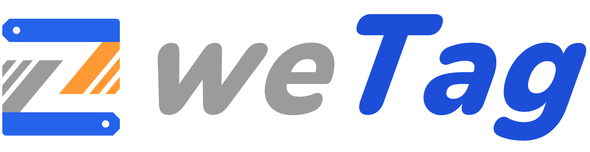
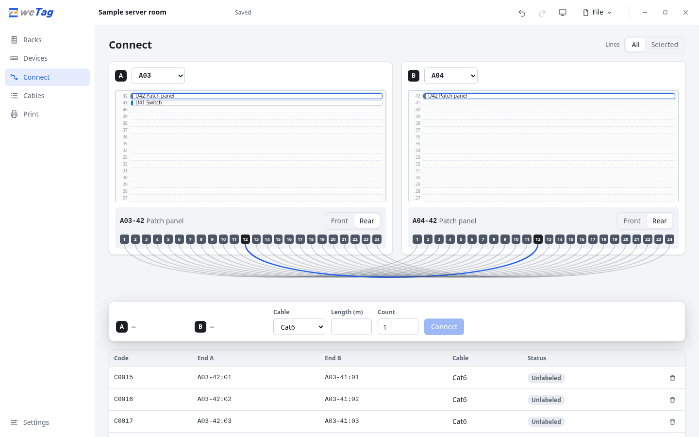
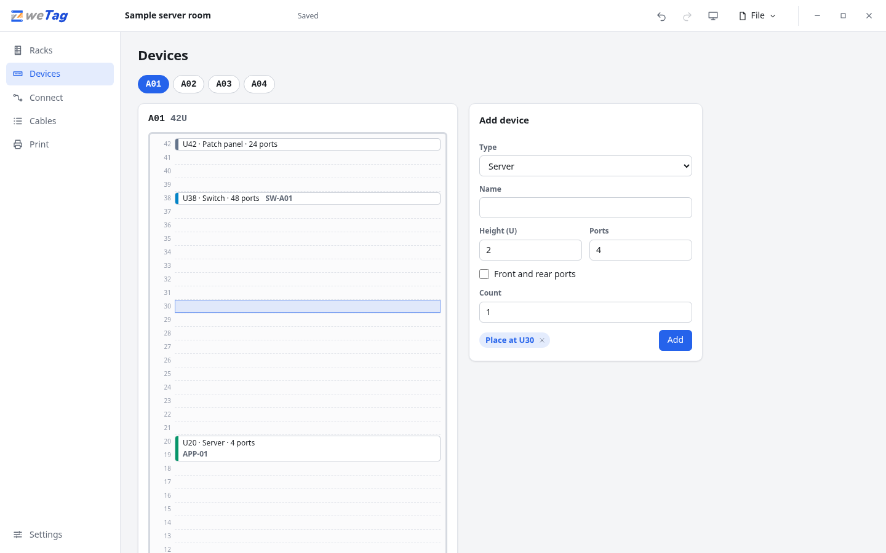
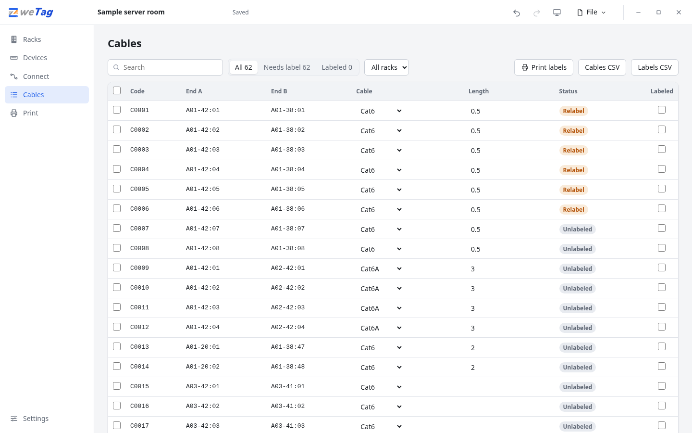
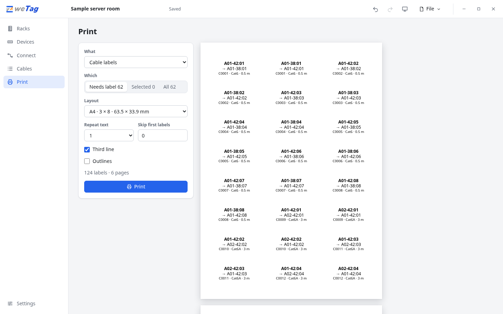
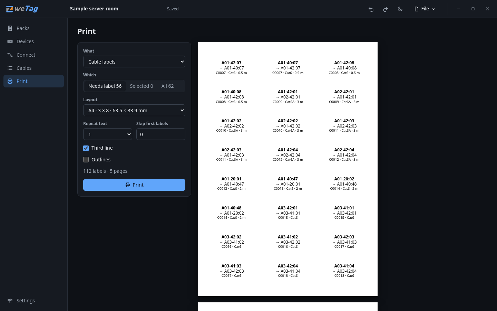
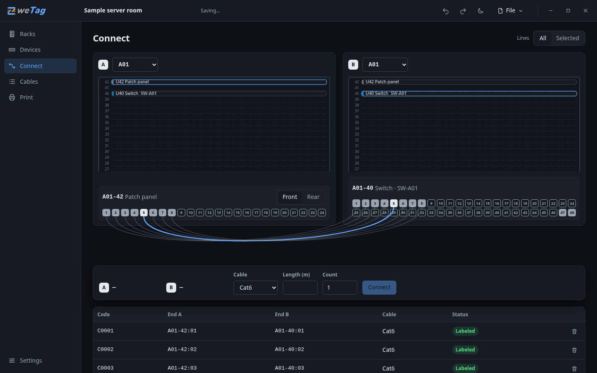
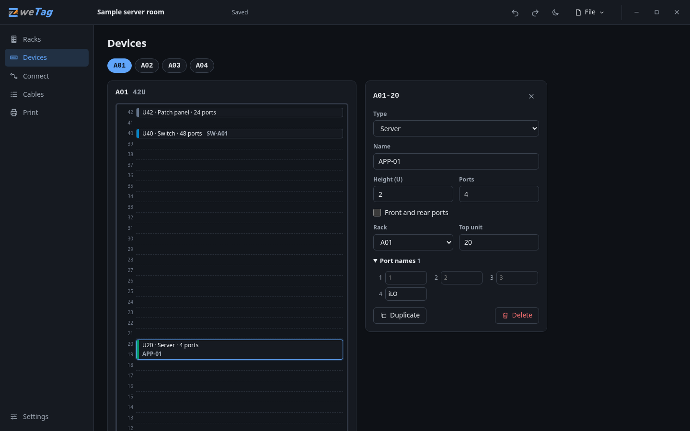

  <picture>
    <source media="(prefers-color-scheme: dark)" srcset="logo/lockup/lockup-dark.svg">
    
  </picture>

<h1 align="center">ZweTag</h1>

  Draw your racks, connect the ports, print a standard label for both ends of every cable. 
  Free, offline, one file. Your data never leaves your machine.

  
  
  

  <a href="https://zweken.github.io/ZweTag/"><b>Try it in your browser</b></a> ·
  <a href="https://github.com/zweken/ZweTag/releases/latest">Download</a>

## The problem

A cable marked `100` tells you nothing, and sooner or later someone marks a second cable `100`.
To find the other end you pull on it and hope.

ZweTag gives every cable end an address instead of a number. Pick up either end and the label
says where you are and where the other end is:

    A01-40:12
    → A02-38:12
    C0017 · Cat6 · 2 m

`A01` is the rack, `40` is the rack unit of the device, `12` is the port. The other end carries
the same two lines the other way round. The scheme is modeled on the identifier style of ANSI/TIA-606,
the administration standard for cabling.

## How it works

1. **Racks** — say how many rooms and racks you have.
2. **Devices** — add each device: its type, its height and how many ports it has.
3. **Connect** — two racks side by side. Click a port, click the other port. Both labels appear at
   once. Connect 24 ports in one step.
4. **Cables** — every cable in one list, with what still needs a label.
5. **Print** — label sheets, a label printer, or CSV for the software that came with your printer.

<table>
  <tr>
    <td></td>
    <td></td>
  </tr>
  <tr>
    <td></td>
    <td></td>
  </tr>
  <tr>
    <td></td>
    <td></td>
  </tr>
</table>

## What you get

- A label for **both ends** of every cable, each naming its own end first.
- Patch panels with a **front and a rear**: the patch cord and the fixed cable behind it are two cables.
- **Bulk work**: connect a whole panel in one step, add ten identical servers at once.
- **Relabel tracking**: tick a cable when its label is on. Move a device and its cables ask for a new label.
- Labels for racks and devices, and a printable cable schedule.
- Label sheets (A4 and Letter), single labels for label printers, or your own layout.
- CSV export for cables and for labels.
- Undo, dark and light themes.
- One JSON file. No install, no account, no telemetry, no network requests.

## Download

Pick the file for your computer on the [latest release](https://github.com/zweken/ZweTag/releases/latest):

| Your computer | File |
|---|---|
| Windows 10 or 11 | `ZweTag.exe` |
| Mac with Apple silicon (M1 or later) | `zwetag-darwin-arm64` |
| Mac with an Intel processor | `zwetag-darwin-amd64` |
| Linux on a 64-bit PC | `zwetag-linux-amd64` |
| Linux on 64-bit ARM, such as a Raspberry Pi 4 or 5 | `zwetag-linux-arm64` |

Each is a single file with nothing to install. Your project is saved as `zwetag.json` next to it.

**Windows** — run `ZweTag.exe`. It opens in its own window, using the WebView2 runtime that ships
with Windows 11 and current Windows 10.

**macOS and Linux** — ZweTag opens in your default browser. Make the file executable once and run
it from a terminal, for example:

    chmod +x zwetag-darwin-arm64
    ./zwetag-darwin-arm64

A Mac stops the first run because the program is not notarized by Apple: open System Settings →
Privacy & Security, allow the program under Security, and run it again.

**No download** — [use it online](https://zweken.github.io/ZweTag/). The project is stored in your
browser and can be saved to a file.

### About the Windows warning

The program is not code-signed yet, so Windows SmartScreen asks before the first run. Check what
you downloaded against `SHA256SUMS` on the release page, or verify its build provenance:

    gh attestation verify ZweTag.exe --owner zweken

How releases are built, approved and, later, signed: [code signing policy](CODE_SIGNING.md).

## Printing labels

See [docs/label-printing.md](docs/label-printing.md).

## Your data

ZweTag keeps one file, `zwetag.json`. Its format is documented in
[spec/project-format.md](spec/project-format.md). Nothing is uploaded: the program talks only to
itself on `127.0.0.1`, and the online version runs entirely in your browser.

## The label format

The exact rules are in [spec/tag-format.md](spec/tag-format.md), with test vectors in
[spec/tag-vectors.json](spec/tag-vectors.json) for anyone who wants to produce the same labels
elsewhere.

The scheme is modeled on the identifier style of ANSI/TIA-606. It is ZweTag's own description, not
a copy or an implementation of that standard, and ZweTag does not claim conformance with it.

A server with several nodes, or a blade chassis, is one device: add it once and name its ports after
the nodes (Devices, then Port names), for example `N2-1`. The label then reads `A01-30:N2-1`.

## What ZweTag is not

It does not discover devices, read live port status or trace a path through several panels, and it
will stay small on purpose.

## Command line

| Flag | Default | Effect |
|---|---|---|
| `--file <path>` | `zwetag.json` next to the program | Project file to open. |
| `--addr <host:port>` | `127.0.0.1:0` | Listen address; port 0 picks a free port. |
| `--server` | | Serve only: no window, no browser. |
| `--version` | | Print the version and exit. |

## Build from source

ZweTag is plain Go with no C toolchain and no Node build step. You need Go 1.25 or newer.

    go build -o zwetag ./cmd/zwetag     # for this machine
    scripts/build.sh 1.0.0              # every release binary, into dist/

Tests and checks (Node 22 or newer is needed only for the interface tests):

    gates/gate.sh

## Contributing

Issues and pull requests are welcome; see [CONTRIBUTING.md](CONTRIBUTING.md).

## About

ZweTag is built by [Zweken Technology](https://www.zweken.com). We build network monitoring and
operations software for industrial and enterprise sites. Our platform, **Zwetwin**, keeps a living
twin of a site's network — every rack, port and cable — and the labeling scheme in ZweTag is the
same one built into Zwetwin. We publish it as a small standalone tool because a readable label on
both ends of a cable should not need a platform.

## License and trademarks

ZweTag is open source under the [Apache License 2.0](LICENSE): free to use, change and
redistribute, including commercially, as long as the license and the [NOTICE](NOTICE) stay with it.
It is provided as is, without warranty.

"ZweTag", "Zwetwin", "Zweken" and the Z logo are trademarks of Zweken Technology. ANSI/TIA-606 is
a standard of the Telecommunications Industry Association; ZweTag is not affiliated with or
endorsed by TIA and does not claim conformance with it.
